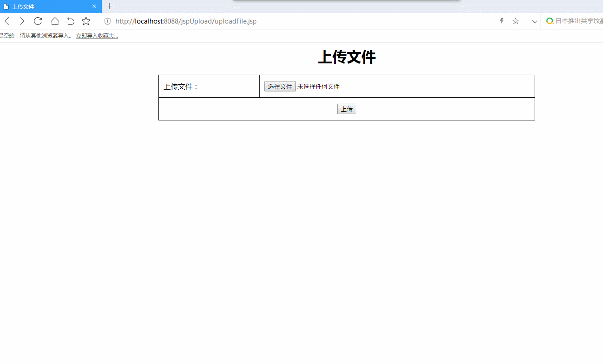

# 功能（1）：文件上传

## 1.实现方式：

1. 使用第三方开源组件实现（Apache的commons-fileupload组件）
2. 基于Servlet3.0实现

## 2.演示效果



## 3.实现步骤

### 3.1 编写上传页面

```jsp
<%@ page contentType="text/html;charset=UTF-8" language="java" %>
<html>
<head>
    <meta charset="UTF-8">
    <title>上传文件</title>
    <style type="text/css">
        table{
            width: 50%;
            margin: 0px auto;
            border: solid 1px black;
            border-collapse: collapse;
        }
        tr{
            height: 50px;
        }
        td{
            border: solid 1px black;
            padding: 10px;
        }
    </style>
</head>
<body>
<h1 align="center">上传文件</h1>
<form action="uploadFile" enctype="multipart/form-data" method="POST" >
    <table>
        <tr>
            <td>上传文件：</td>
            <td>
                <input type="file" name="uploadFile" id="file" /> 
            </td>
        </tr>
        <tr>
            <td colspan="2" align="center">
                <input type="submit" value="上传"/>
            </td>
        </tr>
    </table>
</form>
</body>
</html>
```

**注意：**表单中要添加<u>*enctype="multipart/form-data"*</u>属性，才能实现文件上传。


### 3.2 开发处理文件上传的Servlet

```java
package com.foxbill.controller;

import org.apache.commons.fileupload.FileItem;
import org.apache.commons.fileupload.disk.DiskFileItemFactory;
import org.apache.commons.fileupload.servlet.ServletFileUpload;

import javax.servlet.ServletException;
import javax.servlet.annotation.WebServlet;
import javax.servlet.http.HttpServlet;
import javax.servlet.http.HttpServletRequest;
import javax.servlet.http.HttpServletResponse;
import java.io.File;
import java.io.IOException;
import java.util.Iterator;
import java.util.List;

@WebServlet("/uploadFile")
public class UploadFileServlet extends HttpServlet {
    // 上传文件存储目录
    private static final String UPLOAD_DIRECTORY = "upload";

    /**
     * 上传数据及保存文件
     */
    @Override
    protected void doPost(HttpServletRequest request,
                          HttpServletResponse response) throws ServletException, IOException {

        // 配置上传参数
        DiskFileItemFactory factory = new DiskFileItemFactory();// Create a factory for disk-based file items
        ServletFileUpload upload = new ServletFileUpload(factory);// Create a new file upload handler
        String uploadPath = getServletContext().getRealPath("/") + UPLOAD_DIRECTORY;// 构造临时路径来存储上传的文件

        // 如果目录不存在则创建
        File uploadDir = new File(uploadPath);
        if (!uploadDir.exists()) {
            uploadDir.mkdir();
        }

        try {
            // 解析请求的内容提取文件数据
            List<FileItem> formItems = upload.parseRequest(request);

            if (formItems != null && formItems.size() > 0) {
                // 迭代表单数据
                Iterator<FileItem> iter = formItems.iterator();
                while (iter.hasNext()) {
                    FileItem item = iter.next();
                    if (!item.isFormField()) {
                        /* 如果是文件上传表单域 */
                        String fileName = new File(item.getName()).getName();
                        String filePath = uploadPath + File.separator + fileName;//文件的上传路径
                        File storeFile = new File(filePath);
                        item.write(storeFile);// 保存文件到硬盘
                        request.setAttribute("message","文件上传成功!");
                    }
                }
            }
        } catch (Exception ex) {
            request.setAttribute("message","错误信息: " + ex.getMessage());
        }
        // 跳转到 message.jsp
        getServletContext().getRequestDispatcher("/uploadFilemessage.jsp").forward(request, response);
    }

    @Override
    protected void doGet(HttpServletRequest req, HttpServletResponse resp) throws ServletException, IOException {
        doPost(req,resp);
    }
}
```

### 3.3 编写消息页面

```jsp
<%@ page language="java" contentType="text/html; charset=UTF-8"
         pageEncoding="UTF-8" isELIgnored="false" %>
<html>
<head>
    <meta http-equiv="Content-Type" content="text/html; charset=UTF-8">
    <title>文件上传结果</title>
</head>
<body>

    <h2 align="center">${message}</h2>

</body>
</html>
```

文件名为：uploadFilemessage.jsp

## 4. 关联功能

### 4.1 图片上传并预览

#### 4.1.1 图片上传

（1）使用“文件上传”的代码，既可以实现图片上传。

（2）可以在**上传页面**中，进行代码优化，给文件域添加accept属性为“image/*”，实现选择文件时，过滤掉非图片的文件。（但，如果仍选择非图片文件，该文件也可以上传）

```Html
<input type="file" name="uploadFile" id="file" accept="image/*" />
```

#### 4.1.2 图片预览

（1）在**上传页面**中，给文件域添加onchange事件处理函数

```html
<input type="file" name="uploadFile" id="file" accept="image/*" onchange="imgChange(this);"/> <!--文件上传选择按钮-->
```

（2）添加<script>脚本

```javascript
<script type="text/javascript">
    // 实现图片预览功能
    function imgChange(obj) {
        //获取点击的文本框
        var file =document.getElementById("file");
        console.log(file);
        console.log(file.files[0])
        //var imgUrl = window.URL.createObjectURL(file.files[0]);
        var imgUrl = getObjectURL(file.files[0]);
        console.log(imgUrl);
        var img =document.getElementById('imghead');
        img.setAttribute('src',imgUrl); // 修改img标签src属性值
    };

    //建立一個可存取到該file的url（兼容各种浏览器）
    function getObjectURL(file) {
        var url = null;
        if (window.createObjectURL != undefined) { // basic
            url = window.createObjectURL(file);
        } else if (window.URL != undefined) { // mozilla(firefox)
            url = window.URL.createObjectURL(file);
        } else if (window.webkitURL != undefined) { // webkit or chrome
            url = window.webkitURL.createObjectURL(file);
        }
        return url;
    }
</script>
```

### 4.2 文件重命名

使用UUID给文件生成随机的名字。

```java
String fileName = UUID.randomUUID().toString();
```

### 4.3 获取普通表单域

```
String name = item.getFieldName();
String value = item.getString();
//若出现中文编码问题，可以使用下面的代码
//String value =  new String(item.getString().getBytes("ISO-8859-1"), "utf-8");
```

## 5. 相关参数设置

```java
// 上传配置
private static final int MEMORY_THRESHOLD   = 1024 * 1024 * 3;  // 3MB
private static final int MAX_FILE_SIZE      = 1024 * 1024 * 40; // 40MB
private static final int MAX_REQUEST_SIZE   = 1024 * 1024 * 50; // 50MB

// Create a factory for disk-based file items
DiskFileItemFactory factory = new DiskFileItemFactory();
// Set factory constraints
factory.setSizeThreshold(MEMORY_THRESHOLD);// 设置内存临界值 - 超过后将产生临时文件并存储于临时目录中
factory.setRepository(new File(System.getProperty("java.io.tmpdir")));// 设置临时存储目录

// Create a new file upload handler
ServletFileUpload upload = new ServletFileUpload(factory);

upload.setFileSizeMax(MAX_FILE_SIZE);// 设置最大文件上传值
upload.setSizeMax(MAX_REQUEST_SIZE);// 设置最大请求值 (包含文件和表单数据)
upload.setHeaderEncoding("UTF-8");// 中文处理

```

# 功能（2）：分页功能


