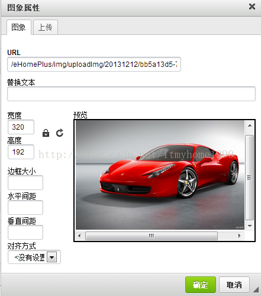

# 功能（1）：文件上传

## 1.实现方式：

1. 方式一：基于第三方开源组件实现（Apache的commons-fileupload、commons-io组件）
2. 方式二：基于Servlet3.0实现

## 2.演示效果


## 3.实现步骤

### 方式一：

#### 3.1 编写上传页面

```jsp
<%@ page contentType="text/html;charset=UTF-8" language="java" %>
<html>
<head>
  <meta charset="UTF-8">
  <title>上传文件</title>
  <style type="text/css">
    table{
      width: 50%;
      margin: 0px auto;
      border: solid 1px black;
      border-collapse: collapse;
    }
    tr{
      height: 50px;
    }
    td{
      border: solid 1px black;
      padding: 10px;
    }
  </style>
</head>
<body>
<h1 align="center">上传文件</h1>
<form action="uploadFile1" enctype="multipart/form-data" method="POST" >
  <table>
    <tr>
      <td>上传文件：</td>
      <td>
        <input type="file" name="uploadFile" id="file" />
      </td>
    </tr>
    <tr>
      <td colspan="2" align="center">
        <input type="submit" value="上传"/>
      </td>
    </tr>
  </table>
</form>
</body>
</html>
```

**注意：**表单中要添加<u>*enctype="multipart/form-data"*</u>属性，才能实现文件上传。


#### 3.2 开发处理文件上传的Servlet

```java
package com.foxbill.controller;

import org.apache.commons.fileupload.FileItem;
import org.apache.commons.fileupload.disk.DiskFileItemFactory;
import org.apache.commons.fileupload.servlet.ServletFileUpload;

import javax.servlet.ServletException;
import javax.servlet.annotation.WebServlet;
import javax.servlet.http.HttpServlet;
import javax.servlet.http.HttpServletRequest;
import javax.servlet.http.HttpServletResponse;
import java.io.File;
import java.io.IOException;
import java.util.Iterator;
import java.util.List;

@WebServlet("/uploadFile1")
public class UploadFileServlet extends HttpServlet {
    // 上传文件存储目录
    private static final String UPLOAD_DIRECTORY = "upload";

    /**
     * 上传数据及保存文件
     */
    @Override
    protected void doPost(HttpServletRequest request,
                          HttpServletResponse response) throws ServletException, IOException {

        // 配置上传参数
        DiskFileItemFactory factory = new DiskFileItemFactory();// Create a factory for disk-based file items
        ServletFileUpload upload = new ServletFileUpload(factory);// Create a new file upload handler
        String uploadPath = getServletContext().getRealPath("/") + UPLOAD_DIRECTORY;// 构造临时路径来存储上传的文件
        System.out.println(uploadPath);

        // 如果目录不存在则创建
        File uploadDir = new File(uploadPath);
        if (!uploadDir.exists()) {
            uploadDir.mkdir();
        }

        try {
            // 解析请求的内容提取文件数据
            List<FileItem> formItems = upload.parseRequest(request);

            if (formItems != null && formItems.size() > 0) {
                // 迭代表单数据
                Iterator<FileItem> iter = formItems.iterator();
                while (iter.hasNext()) {
                    FileItem item = iter.next();
                    if (!item.isFormField()) {
                        /* 如果是文件上传表单域 */
                        String fileName = new File(item.getName()).getName();
                        String filePath = uploadPath + File.separator + fileName;//文件的上传路径
                        File storeFile = new File(filePath);
                        item.write(storeFile);// 保存文件到硬盘
                        request.setAttribute("message","文件上传成功!");
                    }
                }
            }
        } catch (Exception ex) {
            request.setAttribute("message","错误信息: " + ex.getMessage());
        }
        // 跳转到 message.jsp
        getServletContext().getRequestDispatcher("/message.jsp").forward(request, response);
    }

    @Override
    protected void doGet(HttpServletRequest req, HttpServletResponse resp) throws ServletException, IOException {
        doPost(req,resp);
    }
}
```

**注意：**导入jar包（commons-fileupload-1.x.jar和commons-io-x.x.jar）

#### 3.3 编写消息页面

```jsp
<%@ page language="java" contentType="text/html; charset=UTF-8"
         pageEncoding="UTF-8" isELIgnored="false" %>
<html>
<head>
    <title>文件上传结果</title>
</head>
<body>

<h2 align="center">${message}</h2>

</body>
</html>
```

文件名为：message.jsp

### 方式二：

#### 3.1 编写上传页面

```jsp
<form action="uploadFile2" enctype="multipart/form-data" method="POST" >
```

其他同上

#### 3.2 开发处理文件上传的Servlet

```java
package com.foxbill.controller;

import javax.servlet.ServletException;
import javax.servlet.annotation.MultipartConfig;
import javax.servlet.annotation.WebServlet;
import javax.servlet.http.HttpServlet;
import javax.servlet.http.HttpServletRequest;
import javax.servlet.http.HttpServletResponse;
import javax.servlet.http.Part;
import java.io.File;
import java.io.IOException;
import java.text.SimpleDateFormat;
import java.util.Date;

@WebServlet(name = "UploadServlet",urlPatterns = "/uploadFile2")
@MultipartConfig(maxFileSize = 1024*50*1024)
public class UploadServlet extends HttpServlet {
    protected void doPost(HttpServletRequest request, HttpServletResponse response) throws ServletException, IOException {
        request.setCharacterEncoding("utf-8");
        response.setCharacterEncoding("utf-8");
        // 获取普通表单域
        /*
        String author = request.getParameter("author");
        System.out.println(author);
        */
        // 1. 定义路径
        String realPath = this.getServletContext().getRealPath("/upload/");

        // 2. 如果该文件夹不存在、则帮我创建出来
        File file = new File(realPath);
        if (!file.exists()){
            file.mkdirs();
        }
        Part fileSource = null;

        try {
            // 3. 获取上传文件
            fileSource = request.getPart("uploadFile");
        } catch (Exception e) {
            throw new RuntimeException("\"文件上传失败，请上传小于5kb的文件\""+e);
        }
        // 4. 获取上传文件的文件名
        //Tomcat8 可用
        String fileName = fileSource.getSubmittedFileName();
        //Tomcat7 可用
        /*
        String fileName = fileSource.getHeader("Content-Disposition");
        fileName = fileName.substring(fileName.lastIndexOf("=")+2, fileName.length()-1);//截取不同类型的文件需要自行判断
         */

        //4.2 更改上传文件名称:
        String currentDate = new SimpleDateFormat("yyyyMMdd").format(new Date());
        // 如果文件名称存在
        if (!fileName.equals("") || fileName != null){
            fileName = currentDate + "_" + fileName;
        }

        fileSource.write(realPath+"/"+fileName);

        request.setAttribute("message","添加资源成功！");
        request.getRequestDispatcher("message.jsp").forward(request,response);
    }

    protected void doGet(HttpServletRequest request, HttpServletResponse response) throws ServletException, IOException {
        doPost(request,response);
    }
}
```

#### 3.3 编写消息页面

```jsp
同上
```

## 4. 关联功能

### 4.1 图片上传并预览

#### 4.1.0 案例演示


#### 4.1.1 图片上传

（1）使用“文件上传”的代码，既可以实现图片上传。

（2）可以在**上传页面**中，进行代码优化，给文件域添加accept属性为“image/*”，实现选择文件时，过滤掉非图片的文件。（但，如果仍选择非图片文件，该文件也可以上传）

```Html
<input type="file" name="uploadFile" id="file" accept="image/*" />
```

#### 4.1.2 图片预览

（1）在**上传页面**中，给文件域添加onchange事件处理函数

```html
<input type="file" name="uploadFile" id="file" accept="image/*" onchange="imgChange(this);"/> <!--文件上传选择按钮-->
```

（2）添加<script>脚本

```javascript
<script type="text/javascript">
    // 实现图片预览功能
    function imgChange(obj) {
        //获取点击的文本框
        var file =document.getElementById("file");
        console.log(file);
        console.log(file.files[0])
        //var imgUrl = window.URL.createObjectURL(file.files[0]);
        var imgUrl = getObjectURL(file.files[0]);
        console.log(imgUrl);
        var img =document.getElementById('imghead');
        img.setAttribute('src',imgUrl); // 修改img标签src属性值
    };

    //建立一個可存取到該file的url（兼容各种浏览器）
    function getObjectURL(file) {
        var url = null;
        if (window.createObjectURL != undefined) { // basic
            url = window.createObjectURL(file);
        } else if (window.URL != undefined) { // mozilla(firefox)
            url = window.URL.createObjectURL(file);
        } else if (window.webkitURL != undefined) { // webkit or chrome
            url = window.webkitURL.createObjectURL(file);
        }
        return url;
    }
</script>
```

### 4.2 文件重命名

使用UUID给文件生成随机的名字。

```java
String fileName = new File(item.getName()).getName();//获取文件名
String suffix = fileName.substring(fileName.lastIndexOf("."));//获取后缀名
fileName = UUID.randomUUID() + suffix;//生成新文件名
```

### 4.3 获取普通表单域

#### 方式一：

```
String name = item.getFieldName();
String value = item.getString();
//若出现中文编码问题，可以使用下面的代码
//String value =  new String(item.getString().getBytes("ISO-8859-1"), "utf-8");
```

#### 方式二：

```
String author = request.getParameter("author");
```

## 5. 相关参数设置

#### 方式一：

```java
// 上传配置
private static final int MEMORY_THRESHOLD   = 1024 * 1024 * 3;  // 3MB
private static final int MAX_FILE_SIZE      = 1024 * 1024 * 40; // 40MB
private static final int MAX_REQUEST_SIZE   = 1024 * 1024 * 50; // 50MB

// Create a factory for disk-based file items
DiskFileItemFactory factory = new DiskFileItemFactory();
// Set factory constraints
factory.setSizeThreshold(MEMORY_THRESHOLD);// 设置内存临界值 - 超过后将产生临时文件并存储于临时目录中
factory.setRepository(new File(System.getProperty("java.io.tmpdir")));// 设置临时存储目录

// Create a new file upload handler
ServletFileUpload upload = new ServletFileUpload(factory);

upload.setFileSizeMax(MAX_FILE_SIZE);// 设置最大文件上传值
upload.setSizeMax(MAX_REQUEST_SIZE);// 设置最大请求值 (包含文件和表单数据)
upload.setHeaderEncoding("UTF-8");// 中文处理

```

#### 方式二：


# 功能（2）：分页功能

## 1.演示效果


## 2.实现步骤

### 2.1 创建数据表books及测试数据

```mysql
SET FOREIGN_KEY_CHECKS=0;
use test;

DROP TABLE IF EXISTS `books`;
CREATE TABLE `books` (
  `id` varchar(200) NOT NULL,
  `name` varchar(100) NOT NULL,
  `price` double DEFAULT NULL,
  `pnum` int(11) DEFAULT NULL,
  `category` varchar(50) DEFAULT NULL,
  PRIMARY KEY (`id`)
) ENGINE=InnoDB DEFAULT CHARSET=utf8;

-- ----------------------------
-- Records of books
-- ----------------------------
INSERT INTO `books` VALUES ('1001', 'java编程思想', '98', '100', '计算机');
INSERT INTO `books` VALUES ('1002', '西游记', '10', '50', '文学');
INSERT INTO `books` VALUES ('1003', '九阴真经', '20', '30', '武侠');
INSERT INTO `books` VALUES ('1004', '365夜睡前好故事', '19.8', '50', '少儿');
INSERT INTO `books` VALUES ('1006', '三只小猪', '9.8', '50', '少儿');
INSERT INTO `books` VALUES ('1007', '中华上下五千年', '28', '100', '少儿');
INSERT INTO `books` VALUES ('1008', '三国演义', '9.8', '50', '文学');
```

### 2.2 创建实体Book及分页模型PageModel

Book实体类：

```java
package com.foxbill.domain;

/**
 * Book实体类
 */
public class Book {
    private int id;
    private String name;
    private float price;
    private int pnum;
    private String category;

    public int getId() {
        return id;
    }

    public void setId(int id) {
        this.id = id;
    }

    public String getName() {
        return name;
    }

    public void setName(String name) {
        this.name = name;
    }

    public float getPrice() {
        return price;
    }

    public void setPrice(float price) {
        this.price = price;
    }

    public int getPnum() {
        return pnum;
    }

    public void setPnum(int pnum) {
        this.pnum = pnum;
    }

    public String getCategory() {
        return category;
    }

    public void setCategory(String category) {
        this.category = category;
    }
}
```


PageModel实体类：

```java
package com.foxbill.domain;

import java.util.List;

/** 
 * 封装分页信息 
 * @author Administrator 
 * 
 */  
public class PageModel<E> {  
    //结果集   --- 需要自己查询
    private List<E> list;

    //每页显示记录数
    private int pageSize;
    //查询总记录数  ---  需要自己查询
    private int totalRecords;
    //当前页
    private int pageNo;

    //总页数            （根据总记录数和每页记录数计算）
    private int totalPages;
    //上一页            （根据当前页计算）
    private int previousPageNo;
    //下一页            （根据当前页计算）
    private int nextPageNo;

    /** 
     * 总页数 
     * @return 
     */  
    public int getTotalPages() {  
        return (totalRecords + pageSize - 1) / pageSize;
        //return (totalRecords%pageSize == 0)?(totalRecords/pageSize):(totalRecords/pageSize+1);
    }  

    /** 
     * 上一页 
     * @return 
     */  
    public int getPreviousPageNo() {  
        if (pageNo <= 1) {  
            return 1;  
        }  
        return pageNo - 1;  
    }  
      
    /** 
     * 下一页 
     * @return 
     */  
    public int getNextPageNo() {  
        if (pageNo >= getTotalPages()) {
            return getTotalPages();
        }  
        return pageNo + 1;    
    }  

    /**
     * get set函数  
     * @return
     */
    public List<E> getList() {  
        return list;  
    }  
  
    public void setList(List<E> list) {  
        this.list = list;  
    }  
  
    public int getTotalRecords() {  
        return totalRecords;  
    }  
  
    public void setTotalRecords(int totalRecords) {  
        this.totalRecords = totalRecords;  
    }  
  
    public int getPageSize() {  
        return pageSize;  
    }  
  
    public void setPageSize(int pageSize) {  
        this.pageSize = pageSize;  
    }  
  
    public int getPageNo() {  
        return pageNo;  
    }  
  
    public void setPageNo(int pageNo) {  
        this.pageNo = pageNo;  
    }  
}
```

### 2.3 创建连接数据库的工具类 DruidUtils

```java
package com.foxbill.util;


import com.alibaba.druid.pool.DruidDataSourceFactory;

import javax.sql.DataSource;
import java.io.InputStream;
import java.sql.Connection;
import java.sql.SQLException;
import java.util.Properties;

/**
 * DruidUtils数据库连接池工具类设计
 * @author Mryang
 */
public class DruidUtils {
    public static DataSource dataSource;

    static {
        try {
            String myFile = "druid.properties";
            InputStream is = DruidUtils.class.getClassLoader().getResourceAsStream(myFile);
            Properties props = new Properties();
            props.load(is);
            dataSource = DruidDataSourceFactory.createDataSource(props);
        } catch (Exception e) {
            throw  new RuntimeException(e);
        }
    }

    /**
     * 获取数据源
     * @return
     */
    public static  DataSource getDataSource(){
        return  dataSource;
    }

    /**
     * 通过数据源获取连接
     * @return
     */
    public static Connection getConnection(){
        try {
            return  dataSource.getConnection();
        } catch (SQLException e) {
            throw  new RuntimeException(e);
        }
    }
}
```

在IDEA的resources文件夹中，保存druid.properties文件，内容如下：

```properties
driverClassName=com.mysql.jdbc.Driver
url=jdbc:mysql://localhost:3306/test?useUnicode=true&characterEncoding=UTF-8
username=root
password=root
```

### 2.4 创建BookDao

```java
package com.foxbill.dao;


import com.foxbill.domain.Book;
import com.foxbill.domain.PageModel;
import com.foxbill.util.DBUtil;
import com.foxbill.util.DruidUtils;
import org.apache.commons.dbutils.QueryRunner;
import org.apache.commons.dbutils.handlers.BeanListHandler;
import org.apache.commons.dbutils.handlers.ScalarHandler;

import java.sql.Connection;
import java.sql.PreparedStatement;
import java.sql.ResultSet;
import java.sql.SQLException;
import java.util.ArrayList;
import java.util.List;

public class BookDao {
    private QueryRunner qr = new QueryRunner(DruidUtils.getDataSource());

    public PageModel<Book> findData(String pageNo, String pageSize) {
        //声明分页模型
        PageModel<Book> pageModel = null;
        //设置参数默认值
        if (pageSize == null) {// 为空时设置默认页大小为10
            pageSize = "10";
        }
        if (pageNo == null) {// 为空时设置默认为第1页
            pageNo = "1";
        }

        int size = Integer.parseInt(pageSize);
        int no = Integer.parseInt(pageNo);

        //连接数据库，查询分页相关数据
        try {
            String sql = "select * from books limit ?,?";//第一个参数，代表从哪条记录开始；第二个参数，代表一共查询多少条记录。
            List<Book> list = null;

            list = qr.query(sql,new BeanListHandler<Book>(Book.class),(no - 1) * size,size);
            //查询总记录数
            sql = "select count(*) from books";
            Long query = qr.query(sql, new ScalarHandler<>());
            int total = query.intValue();

            //初始化分页模型，并设置参数
            pageModel = new PageModel<Book>();
            pageModel.setPageNo(Integer.parseInt(pageNo));//设置页码
            pageModel.setPageSize(Integer.parseInt(pageSize));//设置每页记录数

            pageModel.setTotalRecords(total);//设置总记录数
            pageModel.setList(list);//设置图书信息（集合）
        } catch (SQLException e) {
            e.printStackTrace();
        }
        return pageModel;
    }

    //测试分页方法
    public static void main(String[] args) {
        BookDao client = new BookDao();
        PageModel<Book> pageModel = client.findData("2", "4");
        List<Book> list = pageModel.getList();
        for (Book a : list) {
            System.out.print("ID:" + a.getId() + ",名称:" + a.getName() + ",价格:" + a.getPrice());
            System.out.println();
        }
        System.out.print("当前页:" + pageModel.getPageNo() + " ");
        System.out.print("共" + pageModel.getTotalPages() + "页  ");
        System.out.print("上一页:" + pageModel.getPreviousPageNo() + " ");
        System.out.print("下一页:" + pageModel.getNextPageNo() + " ");
        System.out.print("尾页:" + pageModel.getTotalPages() + " ");
        System.out.print("共" + pageModel.getTotalRecords() + "条记录");
        System.out.println();
    }

    /*
        查询所有图书
     */
    public List<Book> findAllData() {
        //连接数据库，查询分页相关数据
        String sql = "select * from books";
        List<Book> list = null;
        try {
            list = qr.query(sql, new BeanListHandler<Book>(Book.class));
        } catch (SQLException e) {
            e.printStackTrace();
        }
        return list;
    }

}
```

### 2.5 创建BookServlet

```java
package com.foxbill.servlet;

import com.foxbill.dao.BookDao;
import com.foxbill.domain.Book;
import com.foxbill.domain.PageModel;

import javax.servlet.ServletException;
import javax.servlet.annotation.WebServlet;
import javax.servlet.http.HttpServlet;
import javax.servlet.http.HttpServletRequest;
import javax.servlet.http.HttpServletResponse;
import java.io.IOException;
import java.util.List;


/**
 * Servlet implementation class recomment
 */
@WebServlet(name = "BookServlet",value ="/getBook")
public class BookServlet extends HttpServlet {
    private static final long serialVersionUID = 1L;
    @Override
    protected void doGet(HttpServletRequest request, HttpServletResponse response) throws ServletException, IOException {
        this.doPost(request, response);
    }
    
    @Override
    protected void doPost(HttpServletRequest request, HttpServletResponse response) throws ServletException, IOException {
        /*
            1.设置编码
         */
        request.setCharacterEncoding("UTF-8");
        response.setCharacterEncoding("UTF-8");
        /*
            2.查询数据 -- 返回分页模型对象（包含：集合，当前页，每页记录数，总记录数，总页数，上一页，下一页）
         */
        String pageSize = request.getParameter("pageSize");//获取参数-每页显示行数
        String pageNo = request.getParameter("pageNo");//获取参数-当前显示页次

        BookDao client=new BookDao();
        PageModel<Book> pageModel=client.findData(pageNo,pageSize);//查询分页数据
        request.setAttribute("pageModel", pageModel);//把pageModel分页模型放入request作用域，传递到前端页面进行展示

        /*
            3.转发到result.jsp页面进行数据展示（如果页面展示使用jstl,可以把页面地址改为result-jstl.jsp）
         */
        request.getRequestDispatcher("result-jstl.jsp").forward(request, response);
    }

}
```

### 2.6 显示页面result-jstl.jsp

```jsp
<%@ page language="java" contentType="text/html; charset=utf-8"
         pageEncoding="utf-8" isELIgnored="false" %>
<%@ page import="java.util.*" %>
<%@ page import="com.foxbill.domain.Book" %>
<%@ page import="com.foxbill.domain.PageModel" %>
<%@taglib prefix="c" uri="http://java.sun.com/jsp/jstl/core" %>
<%@taglib prefix="fn" uri="http://java.sun.com/jsp/jstl/functions" %>
<!DOCTYPE html PUBLIC "-//W3C//DTD HTML 4.01 Transitional//EN" "http://www.w3.org/TR/html4/loose.dtd">
<html>
<head>
    <!-- <script src="/haha/js/jquery.min.js" type="text/javascript"></script> -->
    <meta http-equiv="Content-Type" content="text/html; charset=utf-8">
    <title>Insert title here</title>
    <style type="text/css">
        table{
            width: 60%;
            margin: auto;
            border: solid 1px sandybrown;
        }
        caption{
            font-weight: bold;
            font-size: 24px;
        }
        #dataTable td{
            border: solid 1px sandybrown;
        }
        #pageTable{
            margin-top: 10px;
        }
    </style>
</head>
<body>
<table id="dataTable">
    <caption>图书列表</caption>
    <tr align="center">
        <td><b>ID</b></td>
        <td><b>图书名称</b></td>
        <td><b>图书价格</b></td>
        <td><b>图书数量</b></td>
        <td><b>图书类别</b></td>
    </tr>
    <c:if test="${pageModel.list == null || fn:length(pageModel.list) < 1}">
        <tr>
            <td colspan="5" align="center">还没有任何数据！</td>
        </tr>
    </c:if>
    <c:if test="${pageModel.list != null && fn:length(pageModel.list) > 0}">
        <c:forEach items="${pageModel.list}" var="rec">
            <tr>
                <td>${rec.id}</td>
                <td>${rec.name}</td>
                <td>${rec.price}</td>
                <td>${rec.pnum}</td>
                <td>${rec.category}</td>
            </tr>
        </c:forEach>
    </c:if>
</table>
<form name="form1" action="${pageContext.request.contextPath}/getBook" method="post">
    <TABLE id="pageTable">
        <TR>
            <TD align="left">
                共${pageModel.totalRecords}条/<a>每页</a>
                <select name="pageSize"
                        onchange="document.all.pageNo.value='1';document.all.form1.submit();">
                    <option value="5" <c:if test="${pageModel.pageSize == 5}">selected="selected"</c:if>>5</option>
                    <option value="10" <c:if test="${pageModel.pageSize == 10}">selected="selected"</c:if>>10</option>
                    <option value="20" <c:if test="${pageModel.pageSize == 20}">selected="selected"</c:if>>20</option>
                    <option value="30" <c:if test="${pageModel.pageSize == 30}">selected="selected"</c:if>>30</option>
                </select>条</TD>
            <TD align="right">
                <a href="javascript:document.all.pageNo.value='1';document.all.form1.submit();">首页</a>
                <a href="javascript:document.all.pageNo.value='${pageModel.previousPageNo}';document.all.form1.submit();">上一页</a>
                <a href="javascript:document.all.pageNo.value='${pageModel.nextPageNo}';document.all.form1.submit();">下一页</a>
                <a href="javascript:document.all.pageNo.value='${pageModel.totalPages}';document.all.form1.submit();">尾页</a>
                <a>第</a>
                <select name="pageNo" onchange="document.all.form1.submit();">
                    <c:forEach var="i" begin="1" end="${pageModel.totalPages}">
                        <option value="${i}" <c:if test="${pageModel.pageNo == i}">selected="selected"</c:if>>${i}</option>
                    </c:forEach>
                </select><a>页</a>/共${pageModel.totalPages}页</TD>
        </TR>
    </TABLE>
</form>
</body>
</html>
```

# 功能（3）：验证码

## 1.演示效果


## 2.实现方式

### 2.1 数字验证码

```jsp
<%@ page
        import="java.awt.*,java.awt.image.*,java.util.*,javax.imageio.*"%>
<%@ page import="java.io.OutputStream"%>
<%!
    Color getRandColor(int fc, int bc) {
        Random random = new Random();
        if (fc > 255)
            fc = 255;
        if (bc > 255)
            bc = 255;
        int r = fc + random.nextInt(bc - fc);
        int g = fc + random.nextInt(bc - fc);
        int b = fc + random.nextInt(bc - fc);
        return new Color(r, g, b);
    }
%>
<%
    try {
        //取消缓存
        response.setHeader("Pragma", "No-cache");
        response.setHeader("Cache-Control", "no-cache");
        response.setDateHeader("Expires", 0);

        //生成验证码图片
        int width = 60, height = 20;
        //建立BufferedImage对象。指定图片的长度宽度和色彩
        BufferedImage image = new BufferedImage(width, height,
                BufferedImage.TYPE_INT_RGB);
        OutputStream os = response.getOutputStream();
        //取得Graphics对象，用来绘制图片
        Graphics g = image.getGraphics();
        //绘制图片背景和文字，释放Graphics对象所占用的资源
        Random random = new Random();
        g.setColor(getRandColor(200, 250));
        g.fillRect(0, 0, width, height);

        g.setFont(new Font("Times New Roman", Font.PLAIN, 18));
        g.setColor(getRandColor(160, 200));

        for (int i = 0; i < 155; i++) {
            int x = random.nextInt(width);
            int y = random.nextInt(height);
            int xl = random.nextInt(12);
            int yl = random.nextInt(12);
            g.drawLine(x, y, x + xl, y + yl);//生成干扰线
        }
        //生成验证码
        String sRand = "";
        for (int i=0; i<4; i++) {
            String rand = String.valueOf(random.nextInt(10));
            sRand += rand;
            g.setColor(new Color(20 + random.nextInt(110), 20
                    + random.nextInt(110), 20 + random.nextInt(110)));
            g.drawString(rand, 13*i+6, 16);
        }

        session.setAttribute("rand", sRand);//把验证码放入session作用域

        g.dispose();
        //通过ImageIO对象的write静态方法将图片输出。
        ImageIO.write(image, "JPEG", os);
        //知道了图片的生成方法，剩下的问题就是如何将随机数生成到页面上了。要显示图片，只要
        //将生成的图片流返回给response对象，这样用户请求的时候就可以得到图片。而一个JSP
        //页面的page参数的contentType属性可以指定返回的response对象的形式，大家平时
        //的JSP页面中设定的contentType是text/html，所以会被以HTML文件的形式读取和
        //分析。如果设定为image/jpeg，就会被以图片的形式读取和分析
        os.flush();
        os.close();
        os = null;
        response.flushBuffer();
        out.clear();
        out = pageContext.pushBody();
    } catch (IllegalStateException e) {
        System.out.println(e.getMessage());
        e.printStackTrace();
    }
%>
```

### 2.2 英文+数字验证码

```jsp
<%@ page
        import="java.awt.*,java.awt.image.*,java.util.*,javax.imageio.*"%>
<%@ page import="java.io.OutputStream"%>
<%!
    Color getRandColor(int fc, int bc) {
        Random random = new Random();
        if (fc > 255)
            fc = 255;
        if (bc > 255)
            bc = 255;
        int r = fc + random.nextInt(bc - fc);
        int g = fc + random.nextInt(bc - fc);
        int b = fc + random.nextInt(bc - fc);
        return new Color(r, g, b);
    }
%>
<%
    try {
        response.setHeader("Pragma", "No-cache");
        response.setHeader("Cache-Control", "no-cache");
        response.setDateHeader("Expires", 0);
        int width=110, height=20;
        BufferedImage image = new BufferedImage(width, height,
                BufferedImage.TYPE_INT_RGB);
        OutputStream os = response.getOutputStream();
        Graphics g = image.getGraphics();
        Random random = new Random();
        g.setColor(getRandColor(200, 250));
        g.fillRect(0, 0, width, height);

        g.setFont(new Font("Times New Roman", Font.PLAIN, 18));
        g.setColor(getRandColor(160, 200));
        for (int i = 0; i < 155; i++) {
            int x = random.nextInt(width);
            int y = random.nextInt(height);
            int xl = random.nextInt(12);
            int yl = random.nextInt(12);
            g.drawLine(x, y, x + xl, y + yl);
        }
        String[] s = { "A", "B", "C", "D", "E", "F", "G", "H", "I",
                "J", "K", "L", "M", "N", "P", "Q", "R", "S", "T", "U",
                "V", "W", "X", "Y", "Z" };
        String sRand = "";
        for (int i = 0; i < 4; i++) {
            String rand = "";
            if (random.nextBoolean()) {
                rand = String.valueOf(random.nextInt(10));
            } else {
                int index = random.nextInt(25);
                rand = s[index];
            }
            sRand += rand;
            g.setColor(new Color(20 + random.nextInt(10), 20
                    + random.nextInt(110), 20 + random.nextInt(110)));
            g.drawString(rand, 25 * i + 8, 16);
        }
        session.setAttribute("rand", sRand);
        g.dispose();

        ImageIO.write(image, "JPEG", os);
        os.flush();
        os.close();
        os = null;
        response.flushBuffer();
        out.clear();
        out = pageContext.pushBody();
    } catch (IllegalStateException e) {
        System.out.println(e.getMessage());
        e.printStackTrace();
    }
%>
```

### 2.3 中文验证码

```jsp
<%@page contentType="image/jpeg" pageEncoding="UTF-8"
        import="java.awt.*,java.awt.image.*,java.util.*,javax.imageio.*"%>
<%!
    //生成随机颜色
    Color getRandColor(Random random, int fc, int bc) {
        if (fc > 255)
            fc = 255;
        if (bc > 255)
            bc = 255;
        int r = fc + random.nextInt(bc - fc);
        int g = fc + random.nextInt(bc - fc);
        int b = fc + random.nextInt(bc - fc);
        return new Color(r, g, b);
    }
%>
<%
    //设置页面不缓存
    response.setHeader("Pragma", "No-cache");
    response.setHeader("Cache-Control", "no-cache");
    response.setDateHeader("Expires", 0);
// 设置图片的长宽
    int width=106, height=30;
//设置备选汉字，剔除一些不雅的汉字
    String base =
            "\u6211\u662f\u5f90\u5f20\u660e\u71d5\u534e\u541b\u5c24\u6731\u7ea2\u7231\u4f20\u534e\u6768\u5510\u536b\u5b8f\u950b\u5f20\u4e2d\u56fd\u5317\u4eac\u4e0a\u6d77\u5929\u6d25\u6e56\u5317";

//备选汉字的长度
    int length = base.length();
//创建内存图像
    BufferedImage image =
            new BufferedImage(width, height, BufferedImage.TYPE_INT_RGB);
// 获取图形上下文
    Graphics g = image.getGraphics();
//创建随机类的实例
    Random random = new Random();
// 设定图像背景色(因为是做背景，所以偏淡)
    g.setColor(getRandColor(random, 200, 250));
    g.fillRect(0, 0, width, height);
//备选字体
    String[] fontTypes = { "u5b8bu4f53", "u65b0u5b8bu4f53",
            "u9ed1u4f53", "u6977u4f53", "u96b6u4e66" };
    int fontTypesLength = fontTypes.length;
//在图片背景上增加噪点
    g.setColor(getRandColor(random, 160, 200));
    g.setFont(new Font("Times New Roman", Font.PLAIN, 14));
    for (int i=0; i<6; i++) {
        g.drawString("*********************************************",
                0, 5 * (i + 2));
    }
//取随机产生的认证码(6个汉字)
//保存生成的汉字字符串
    String sRand = "";
    for (int i=0; i<3; i++) {
        int start = random.nextInt(length);
        String rand = base.substring(start, start + 1);
        sRand += rand;
//设置字体的颜色
        g.setColor(getRandColor(random, 10, 150));
//设置字体
        g.setFont(new Font(fontTypes[random.nextInt(fontTypesLength)],
                Font.BOLD, 18 + random.nextInt(6)));
//将此汉字画到图片上
        g.drawString(rand, 24*i + 15 + random.nextInt(8), 24);
    }
//将认证码存入session
    session.setAttribute("rand", sRand);
    g.dispose();

//输出图像到页面
    ImageIO.write(image, "JPEG", response.getOutputStream());
%>
```

### 2.4 表达式验证码

```jsp
<%@ page contentType="text/html;charset=gb2312"%>
<%@ page
        import="java.awt.*,java.awt.image.*,java.util.*,javax.imageio.*"%>
<%@ page import="java.io.OutputStream"%>
<%
    try {
        response.setHeader("Pragma", "No-cache");
        response.setHeader("Cache-Control", "no-cache");
        response.setDateHeader("Expires", 0);
        int width = 110, height = 20;
        BufferedImage image = new BufferedImage(width, height,
                BufferedImage.TYPE_INT_RGB);
        OutputStream os = response.getOutputStream();
        Graphics g = image.getGraphics();
        Random random = new Random();
//设置背景颜色
        g.setColor(new Color(251, 244, 166));
//填充指定的矩形
        g.fillRect(0, 0, width, height);
//设置文字的样式
        g.setFont(new Font("Times New Roman", Font.BOLD, 18));
//设置文字的颜色
        g.setColor(new Color(198, 39, 60));
//设置运算符号
        String[] s = { "+", "-" };
        String sRand = "";
//设置运算因子
        int num1 = random.nextInt(100);
        int num2 = random.nextInt(100);
        int index = random.nextInt(2);
        String rand = s[index];
//设置运算结果
        int end = 0;
//得到运算表达式
        sRand = num1 + rand + num2;
//绘制运算表达式
        g.drawString(sRand, 33, 16);
        if (rand.equals("+")) {
            end = num1 + num2;
        } else {
            end = num1 - num2;
        }
        session.setAttribute("rand", end);
        g.dispose();

        ImageIO.write(image, "JPEG", os);
        os.flush();
        os.close();
        os = null;
        response.flushBuffer();
        out.clear();
        out = pageContext.pushBody();
    } catch (IllegalStateException e) {
        System.out.println(e.getMessage());
        e.printStackTrace();
    }
%>
```

## 3.引用验证码

```jsp
<%@ page contentType="text/html;charset=utf-8" %>
<%@ page language="java" import="java.sql.*" errorPage="" %>
<html>
<head>
    <meta http-equiv="Content-Type" content="text/html;
           charset=utf-8">
    <title>用户登录</title>
    <style type="text/css">
        caption {
            font: 18px bold;
        }

        tr {
            height: 60px;
        }

        div {
            color: #ffffFF;
            font-weight: bold;
            background-color: black;
            padding: 10px;
        }

        input[type="submit"] {
            width: 100px;
            height: 30px;
            font-size: 18px;
        }
    </style>
    <script language="javascript">
        function loadimage(i) { //i是为了区分多种验证码，实际使用时，可以不用这个参数。
            document.getElementById("randImage" + i).src = "image" + i + ".jsp?" + Math.random();
        }
    </script>
</head>
<body>
<form action="validate.jsp" method="post" name="loginForm">
    <table width="500" border="0" cellpadding="0" cellspacing="0" align="center">
        <!--DWLayoutTable-->
        <caption>四种验证码的实现</caption>
        <tr>
            <td>数字验证码：</td>
            <td width="118" height="22" valign="middle" align="center">
                <input type="text" name="rand" size="15">
            </td>
            <td width="138" valign="middle" align="center">
                
            </td>
            <td height="36" colspan="3" align="center" valign="middle">
                <a href="javascript:loadimage(0);">
                    看不清点我
                </a>
            </td>
        </tr>
        <tr>
            <td>英文+数字验证码：</td>
            <td width="118" height="22" valign="middle" align="center">
                <input type="text" name="rand" size="15">
            </td>
            <td width="138" valign="middle" align="center">
                
            </td>
            <td height="36" colspan="3" align="center" valign="middle">
                <a href="javascript:loadimage(1);">
                    看不清点我
                </a>
            </td>
        </tr>
        <tr>
            <td>中文验证码：</td>
            <td width="118" height="22" valign="middle" align="center">
                <input type="text" name="rand" size="15">
            </td>
            <td width="138" valign="middle" align="center">
                
            </td>
            <td height="36" colspan="3" align="center" valign="middle">
                <a href="javascript:loadimage(2);">
                    看不清点我
                </a>
            </td>
        </tr>
        <tr>
            <td>表达式验证码：</td>
            <td width="118" height="22" valign="middle" align="center">
                <input type="text" name="rand" size="15">
            </td>
            <td width="138" valign="middle" align="center">
                
            </td>
            <td height="36" colspan="3" align="center" valign="middle">
                <a href="javascript:loadimage(3);">
                    看不清点我
                </a>
            </td>
        </tr>
        <tr>
            <td height="36" colspan="4" align="center" valign="middle">
                <div>Tips:验证码的值，放在session中了！</div>
                <input type="submit" name="login" value="提交">
            </td>
        </tr>
    </table>
</form>
</body>
</html>
```

# 功能（4）：MD5加密


# 功能（5）：富文本编辑器的使用

## 1.演示效果


## 2.实现步骤

### 2.1 在页面引入ckeditor

1.官网下载CKEditor,可选Basic, Standard, Full

解压放置其webapp下


2.JSP中引入以下文件：

```html
<script type="text/javascript" src="ckeditor/ckeditor.js"></script>
<script type="text/javascript" src="ckeditor/config.js"></script>
```

3.有以下几种方法可实现CKEditor

**一：通过设置class样式**

```html
<textarea class="ckeditor" name="editor1"></textarea>
```


**二：使用JS代码**

```javascript
$(document).ready(function(){
	CKEDITOR.replace('content');  //content为textarea元素ID
});
```

**三：使用jquery**

使用jquery之前一定要先引入jquery文件，另外还要引入ckeditor/adapters下的一个jquery.js

(两者不一样，务必要引入)

```javascript
$(document).ready(function(){
	$('textarea#editor1').ckeditor();
});
```


另外配置config.js以满足自己的项目需求。

```javascript
CKEDITOR.editorConfig = function( config ) {
	// Define changes to default configuration here.
	// For the complete reference:
	// http://docs.ckeditor.com/#!/api/CKEDITOR.config
 
	// The toolbar groups arrangement, optimized for a single toolbar row.
	config.toolbarGroups = [
		{ name: 'document',	   groups: [ 'mode', 'document', 'doctools' ] },
		{ name: 'clipboard',   groups: [ 'clipboard', 'undo' ] },
		{ name: 'editing',     groups: [ 'find', 'selection', 'spellchecker' ] },
		{ name: 'forms' },
		{ name: 'basicstyles', groups: [ 'basicstyles', 'cleanup' ] },
		{ name: 'paragraph',   groups: [ 'list', 'indent', 'blocks', 'align', 'bidi' ] },
		{ name: 'links' },
		{ name: 'insert' },
		{ name: 'styles' },
		{ name: 'colors' },
		{ name: 'tools' },
		{ name: 'others' },
		{ name: 'about' }
	];
 
	// The default plugins included in the basic setup define some buttons that
	// we don't want too have in a basic editor. We remove them here.
	config.removeButtons = 'Cut,Copy,Paste,Undo,Redo,Anchor,Underline,Strike,Subscript,Superscript';
 
	// Let's have it basic on dialogs as well.
	config.removeDialogTabs = 'link:advanced';
};
```

### 2.2 实现图片上传

CKEditor编辑器的工具栏中初始的时候应该是这样子的，没有图片上传按钮


并且预览中有一堆火星文，可以修改相应配置删除它。

**第一种方法**： 打开ckeditor/plugins/image/dialogs/image.js文件，搜索“b.config.image_previewText”，(b.config.image_previewText||'')单引号中的内容全删了，注意别删多了。(由于ckeditor的很多js文件都是压缩过的，格式很难看，很容易删错，所以不推荐此种方法)

**第二种方法：**打开config.js文件，加入下面一句话

config.image_previewText=' '; //预览区域显示内容


下面实现图片上传：

打开config.js文件，加入下面一句话

config.filebrowserImageUploadUrl= "ImgUpload.action"; //待会要上传的action或servlet


上面的只是一个上传页面。也就相当于一个HTML的form表单，

要配置点击"上传到服务器上"按钮后请求的Action。已在ckeditor/config.js中配置。

就是上面的 config.filebrowserImageUploadUrl = "ImgUpload.action";

可使用chrome审查元素查看代码


接下来就是Servlet中的上传方法：

```java
package com.foxbill.servlet;

import javax.servlet.ServletException;
import javax.servlet.annotation.MultipartConfig;
import javax.servlet.annotation.WebServlet;
import javax.servlet.http.HttpServlet;
import javax.servlet.http.HttpServletRequest;
import javax.servlet.http.HttpServletResponse;
import javax.servlet.http.Part;
import java.io.File;
import java.io.IOException;
import java.io.PrintWriter;
import java.text.SimpleDateFormat;
import java.util.Date;
import java.util.UUID;

/**
 * 基于Servlet3.0 实现文件（图片）上传
 */
@WebServlet(name = "ImgUploadServlet",urlPatterns = "/ImgUpload.action")
@MultipartConfig(maxFileSize = 1024*50*1024)
public class ImgUploadServlet extends HttpServlet {
    protected void doPost(HttpServletRequest request, HttpServletResponse response) throws ServletException, IOException {
        response.setCharacterEncoding("utf-8");
        PrintWriter out = response.getWriter();
        // CKEditor提交的很重要的一个参数
        String callback = request.getParameter("CKEditorFuncNum");//可以通过浏览器的开发者工具，查看
        String expandedName = ""; // 文件扩展名

        // 1. 定义路径
        String realPath = this.getServletContext().getRealPath("/img/uploadImg/");

        // 2. 如果该文件夹不存在、则创建出来
        File file = new File(realPath);
        if (!file.exists()){
            file.mkdirs();
        }

        Part fileSource = null;
        try {
            // 3. 获取上传文件
            fileSource = request.getPart("upload");
        } catch (Exception e) {
            throw new RuntimeException("\"文件上传失败，请上传小于5kb的文件\""+e);
        }

        //4. 验证文件类型
        String uploadContentType = fileSource.getContentType();//获取文件类型
        //如果文件类型，不为图片，则提示错误
        if (uploadContentType.equals("image/pjpeg") || uploadContentType.equals("image/jpeg")) {
            // IE6上传jpg图片的headimageContentType是image/pjpeg，而IE9以及火狐上传的jpg图片是image/jpeg
            expandedName = ".jpg";
        } else if (uploadContentType.equals("image/png") || uploadContentType.equals("image/x-png")) {
            // IE6上传的png图片的headimageContentType是"image/x-png"
            expandedName = ".png";
        } else if (uploadContentType.equals("image/gif")) {
            expandedName = ".gif";
        } else if (uploadContentType.equals("image/bmp")) {
            expandedName = ".bmp";
        } else {
            out.println("<script type=\"text/javascript\">");
            out.println("window.parent.CKEDITOR.tools.callFunction(" + callback + ",''," + "'文件格式不正确（必须为.jpg/.gif/.bmp/.png文件）');");
            out.println("</script>");
        }

        //5. 验证文件大小
        long size = fileSource.getSize();//获取文件的大小
        System.out.println(size/1024);
        if (size > 600 * 1024) {
            out.println("<script type=\"text/javascript\">");
            out.println("window.parent.CKEDITOR.tools.callFunction(" + callback + ",''," + "'文件大小不得大于600k');");
            out.println("</script>");
            return;
        }

        // 6. 获取上传文件的文件名
        //Tomcat8 可用
        //String fileName = fileSource.getSubmittedFileName();

        //Tomcat7 可用
        String cd = fileSource.getHeader("Content-Disposition");
        //截取不同类型的文件需要自行判断
        String fileName = cd.substring(cd.lastIndexOf("=")+2, cd.length()-1);
        System.out.println(fileName);

        //6.2 更改上传文件名称:
        // 如果文件名称不为空
        if (!fileName.equals("") || fileName != null){
            fileName = UUID.randomUUID() + "_" + fileName;
        }
        //7. 写文件
        fileSource.write(realPath+"/"+fileName);

        // 返回"图像"选项卡并显示图片  request.getContextPath()为web项目名
        out.println("<script type=\"text/javascript\">");
        out.println("window.parent.CKEDITOR.tools.callFunction(" + callback + ",'" + request.getContextPath() + "/img/uploadImg/" + fileName + "','')");
        out.println("</script>");

    }

    protected void doGet(HttpServletRequest request, HttpServletResponse response) throws ServletException, IOException {
        doPost(request,response);
    }
}
```

最后上传图片成功

